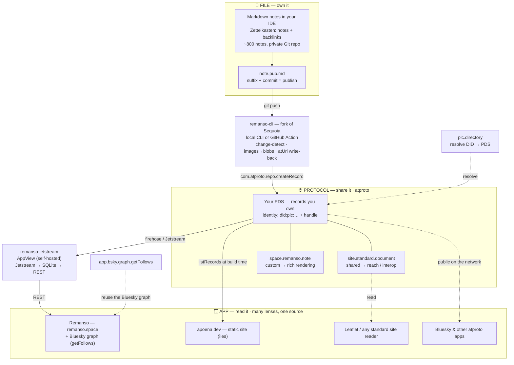

# CFP — `File > Protocol > App`: How a Note‑Taking Habit Became a Voice I Own

> A conference talk proposal by **Julien Calixte**.
> Working draft — see the [Tailoring checklist](#tailoring-checklist) for the bits to fill in per conference.

---

## Title options

Pick one to fit the venue's tone:

1. **`File > Protocol > App`: How a Note‑Taking Habit Became a Voice I Own**
2. **From Private Garden to Public Voice: Building a Note Habit on the AT Protocol**
3. **Apps Killed the Links: Publishing Your Notes on a Network You Own**
4. **Learn, Think, Write, Share — One `*.pub.md` at a Time**

---

## One‑line pitch

For years I was *the child in the room* — agreeing with everyone, able to counter no one. So I started taking notes, and slowly my voice counted. This is the story of how a 5‑year, 800‑note private garden became a public voice I own — **52 notes and counting**, published to the AT Protocol instead of a platform.

---

## Short abstract *(≈75 words — the version most CFP forms ask for)*

We all keep notes; far fewer publish them — because going public usually means renting your voice from a platform that owns your content, your identity, and your audience. I'll tell the story of turning a five‑year, 800‑note habit into a public blog I own, on the AT Protocol. The thesis is a hierarchy: **`File > Protocol > App`**. Your files outlive apps (Steph Ango); a protocol turns them into a *social filesystem* (Dan Abramov); the app is just a lens.

---

## Long description *(≈290 words — for the "detailed abstract" field)*

I didn't start writing to have a blog. I started because I was tired of being the quiet one — the person who *felt* something was wrong with an argument but couldn't say why. So since 2021 I've read and written permanent notes, and little by little my voice counted. Five years and 800+ notes later, I had conviction but no place to put it. A private GitHub repo of Markdown is a beautiful garden — and a closed door.

Two ideas opened it. Steph Ango's **"File over app"**: your work should live in durable, open files that outlast any tool. And Dan Abramov's **"A social filesystem"**: the AT Protocol — the open network under Bluesky — gives every person a personal repository of records they own, with apps as mere views over a shared, public filesystem. Put them together and you get the spine of this talk: **`File > Protocol > App`**. Files first. Protocol second. Apps last.

I'll show the working system I built on that idea — **Remanso** — through four concrete beats:

- **Publish as one gesture.** Suffix a note `*.pub.md`, commit, and a small CLI writes it to *your* server. No form, no dashboard.
- **A shared lexicon for reach, a custom one for richness.** I publish to the *shared* `site.standard.document` schema so any reader renders my notes — and keep a richer custom one (`space.remanso.note`) for my own client.
- **Borrow the graph, don't rebuild it.** A reading feed assembled from the Bluesky social graph — I inherited an audience instead of begging for one.
- **Your own AppView.** A tiny firehose consumer, self‑hosted on my own infrastructure.

You'll leave understanding what atproto actually *is*, and with a realistic path to putting your own writing on a network you own. *Learn, Think, Write, Share.*

---

## Why this talk, why now

- **It's a real, working system — and an honest one.** Everything runs in production, and I'm the first user: **52 notes already published** from my own repo — bilingual, spanning software craft, Lean/TPS, systems thinking, society, and Japanese aesthetics — through the `remanso-cli` publish path, the `site.standard.document` and `space.remanso.note` lexicons, an OAuth client, and a self‑hosted Jetstream AppView. Remanso isn't finished, and I'll say what's still rough.
- **It reframes "own your data" as something you'd actually do.** Everyone nods at data ownership; nobody acts on it. Tying it to a habit people already have — note‑taking — makes the payoff tangible: *the notes you already write can become a blog you own, today.*
- **It's the missing kind of atproto talk.** Most explain Bluesky‑the‑app. Very few show an *independent developer* shipping a non‑microblog product on the protocol — which is exactly where the interesting design questions live (custom lexicons, AppViews, reusing the graph).
- **The timing is right.** The atproto blogging ecosystem just became real — shared lexicons (`standard.site`), community tools (Sequoia), explorers (pdsls, lexicon.garden). It's past "what is it" and into "what can I build."

---

## Themes & influences *(the ideas I'm standing on — credited on stage)*

- **Steph Ango (kepano) — [File over app](https://stephango.com/file-over-app):** prefer durable, open files over apps. *"If you want your writing to still be readable on a computer from the 2060s … it's important that your notes can be read on a computer from the 1960s."*
- **Dan Abramov — [A social filesystem](https://overreacted.io/a-social-filesystem/):** atproto as a social filesystem — everyone owns a personal repository of records; apps are views over a shared, public filesystem; your identity travels with you.
- **Andy Matuschak — [working notes](https://notes.andymatuschak.org/About_these_notes):** permanent, linked notes and the stacked‑notes reading pattern.
- **Sönke Ahrens — [How to Take Smart Notes](https://www.soenkeahrens.de/en/takesmartnotes):** the note habit that compounds into thinking.
- **Jeremy Keith — [Resilient Web Design](https://resilientwebdesign.com):** the web won on *simplicity*; keep it simple.
- **Tim Berners‑Lee — [the original web proposal](https://www.w3.org/History/1989/proposal.html):** information made by all, for all.
- **The atproto community:** Steve Dylan's [Sequoia](https://sequoia.pub) (the CLI I forked), and **colas.dev**, who made Remanso's infrastructure possible.

> The slogan I'll leave them with: **`File > Protocol > App`** — and **Apps killed the links**, so build on files and protocols instead.

---

## Architecture at a glance — `File > Protocol > App`

One source of truth (your files), one network you own (the protocol), many lenses to read it (the apps).

### ASCII

```text
        FILE  ───▶  PROTOCOL  ───▶  APP
       (own it)    (share it)      (read it — many lenses, one source)


   ┌──────────────────────────────┐
   │ FILE — your notes            │
   │ Markdown in a Git repo       │
   │ Zettelkasten: notes + links  │
   │   note.md                    │
   │   note.pub.md   ◀── publish  │
   └───────────────┬──────────────┘
                   │  git push
                   ▼
   ┌──────────────────────────────┐
   │ remanso-cli  (fork: Sequoia) │
   │ local CLI or GitHub Action   │
   │ change-detect · img → blobs  │
   │ writes atUri back            │
   └───────────────┬──────────────┘
                   │  com.atproto.repo.createRecord
                   ▼
   ┌────────────────────────────────────────────────┐
   │ PROTOCOL — your PDS   (records you own)          │
   │ identity: did:plc:… + handle   (via plc.directory)│
   │ addressed by DID + rkey:                         │
   │   site.standard.document   shared → reach/interop│
   │   space.remanso.note       custom → rich render  │
   └────────┬──────────────────────────────┬──────────┘
            │ firehose / Jetstream         │ listRecords (read)
            ▼                              ▼
   ┌─────────────────────────┐   ┌───────────────────────────────┐
   │ remanso-jetstream       │   │ APP — many lenses, one source │
   │ AppView (self-hosted)   │   │  Remanso (remanso.space)       │
   │ Jetstream→SQLite→REST   │──▶│    + Bluesky graph (getFollows)│
   └─────────────────────────┘   │  apoena.dev (static · îles)    │
                                 │  Leaflet / any standard.site   │
     reuse the Bluesky graph ───▶│  Bluesky & other atproto apps  │
     app.bsky.graph.getFollows   └───────────────────────────────┘

   Self-hosted on Coolify (platform.apoena.dev) + Gitea (git.apoena.dev).
   GitHub = push mirror.
```

### Mermaid



> The whole stack is self-hosted: **Coolify** (`platform.apoena.dev`) runs the AppView and apps, **Gitea** (`git.apoena.dev`) hosts the code, with **GitHub** as a push mirror.

---

## Detailed outline *(designed for a 25–30 min slot; timings approximate)*

1. **The child in the room** *(≈4 min)*
   - Why I started: not to publish, but to stop being the one who couldn't counter an argument.
   - 2021 → today: permanent notes, backlinks, stacked reading; 800+ notes; *my voice counted*.
   - The closed door: a private garden in a Git repo is durable and mine — and invisible.

2. **`File > Protocol > App`** *(≈4 min)* — the spine of the talk:
   - **File over app** (Ango): own durable files, not app silos.
   - **A social filesystem** (Abramov): a protocol turns those files into a *shared, social* filesystem.
   - **Apps killed the links**: why platforms keep you in and the open web pushes you out — and why the ordering matters.

3. **AT Protocol in five minutes** *(≈6 min)* — the only "concepts" section, framed as a filesystem:
   - **Identity** = a portable name (DID / handle) you keep across apps.
   - **PDS** = your personal repository — the filesystem you own.
   - **Lexicons** = typed schemas (file types); anyone can define one (`space.remanso.note` is mine).
   - **Firehose / Jetstream + AppViews** = the stream of changes, and how apps read the network without a central database.

4. **Opening the garage door — Remanso** *(≈11 min)* — live, on screen:
   - **Publish in one gesture**: `*.pub.md` + commit → `remanso publish` (a CLI I forked from the community's Sequoia, run locally or as a GitHub Action) → records on my PDS, with content‑hash change detection and the resulting `atUri` written back into the note's frontmatter. *Lower every wall.*
   - **Lexicons — reach vs. richness**: my 52 notes are published as *shared* `site.standard.document` records, so my static blog at apoena.dev — and any other `standard.site` reader — renders them for free. The toolchain also supports a richer custom lexicon, `space.remanso.note` (LaTeX, Mermaid, embeds, image blobs, language, theme), for the Remanso client. Interop **and** custom power.
   - **Read with someone else's graph**: build a "following" feed from `app.bsky.graph.getFollows` — I inherited a social network instead of begging people to join one.
   - **Auth without secrets, identity you can prove**: a browser OAuth client (DPoP‑bound tokens, public `client-metadata.json`, no client secret) for in‑app publishing — and `remanso inject` drops verification link tags into the static site, so the writing is provably tied to my atproto identity.
   - **Your own AppView**: a Deno Jetstream consumer filtering my collection into SQLite, served as a tiny REST API, self‑hosted on my own infra (Coolify + Gitea).

5. **What this changes — and what it doesn't** *(≈4 min)*
   - Takeaways, and an honest list of rough edges (lexicon design, blob limits, discovery, "it's still early").
   - The blueprint: how *you* could publish your notes this week. *Learn, Think, Write, Share.*

> **Lightning‑talk variant (5–10 min):** keep sections 1, 2, and the *publish‑in‑one‑gesture* + *borrow‑the‑graph* beats of section 4. Drop the deep concepts and the AppView internals.

---

## Key takeaways

The audience will leave able to:

1. **Internalize `File > Protocol > App`** as a way to choose tools that won't trap their work.
2. **Explain what the AT Protocol is** underneath Bluesky — identity, PDS, lexicons, firehose — as a *social filesystem*, without hand‑waving.
3. **See data ownership made concrete**: records on a server you control, addressed by your identity, readable by any app.
4. **Choose between a custom and a shared lexicon**, and understand the interop trade‑off.
5. **Reuse an existing social graph** instead of bootstrapping an audience from zero.
6. **Sketch a minimal AppView** (firehose → store → API) they could build themselves.

---

## Target audience & level

- **Who**: web/indie developers, digital‑gardeners, the "I have a notes folder and a half‑dead blog" crowd, and anyone curious about decentralized social beyond "Bluesky is Twitter again."
- **Level**: intermediate. Comfortable with web fundamentals (HTTP, JSON, OAuth at a glance). **No prior AT Protocol knowledge required** — the concepts section is self‑contained.
- **Not required**: experience with Bluesky, federation, or distributed systems.

---

## Format & logistics

- **Preferred length**: 25–30 min + Q&A. Compresses cleanly to a 5–10 min lightning talk (see variant above).
- **Style**: narrative — a personal story carrying a technical spine — with live walk‑throughs of real code and real published records (no slideware‑only abstractions).
- **A/V**: standard projector/HDMI; I run the demo from my own laptop. Internet is *nice‑to‑have* (live publish demo) but I'll have a recorded fallback so the talk survives venue Wi‑Fi.
- **Language**: English (also available in French).

---

## Speaker bio *(fill in / trim to the venue's word limit)*

Julien Calixte — *[role / company]*. Indie developer who builds and self‑hosts small web apps on his own infrastructure (the `*.apoena.dev` stack). A five‑years‑deep note‑taker and recent convert to publishing in the open, he built **Remanso** (grown out of his private "Lite Note" habit) to put his writing on the AT Protocol under one motto: *Learn, Think, Write, Share.*

- Blog: https://apoena.dev
- Project: https://remanso.space
- *[Bluesky handle, GitHub, etc. — add]*

---

## Supporting material *(for reviewers)*

- **My journey, in my own words** (published on atproto via Remanso): *"My journey in the AT Proto world"*, *"Apps killed the links"*, *"Personal websites are the new web."*
- **The published corpus**: 52 `*.pub.md` notes live on my PDS (`did:plc:4m3kouplb7s7xozjd3whinvl`, collection `site.standard.document`) — browsable on [pdsls.dev](https://pdsls.dev/at://did:plc:4m3kouplb7s7xozjd3whinvl/site.standard.document). Range: software craft (SRP, microcommits, code calisthenics), Lean/TPS (jidoka, gemba, poka‑yoke, takt time), systems thinking (Meadows' traps), society & politics, philosophy, and Japanese aesthetics (Ma 間, Sakura 桜, Takumi 匠).
- **Remanso** (the publishing client + custom lexicon): https://remanso.space — lexicon `space.remanso.note` (see it in the wild on [ufos.microcosm.blue](https://ufos.microcosm.blue/collection/?nsid=space.remanso.note)).
- **`remanso-cli`**: the publishing engine — a Bun/TypeScript CLI (`auth` / `init` / `publish` / `sync` / `inject`) that writes `*.pub.md` notes to a PDS as *both* `space.remanso.note` and `site.standard.document` records, run locally or as a GitHub Action. A fork of the community's [Sequoia](https://sequoia.pub) by Steve Dylan, extended to emit the custom Remanso lexicon.
- **The AppView** (`remanso-jetstream`): a Deno Jetstream consumer for `space.remanso.note` → SQLite → REST.
- **apoena.dev**: a static blog (îles) that renders `site.standard.document` records read from a PDS at build time — proof of the interop angle.
- **The essays**: [File over app](https://stephango.com/file-over-app) · [A social filesystem](https://overreacted.io/a-social-filesystem/).

---

## Tailoring checklist

A CFP lands best when it's aimed. Before submitting to a specific conference, fill these in — they're the things only you can decide:

- [ ] **Target conference / track** — and trim each section to its stated word limits (short vs. detailed abstract are usually separate fields).
- [ ] **Exact talk length** offered by the CFP (the outline assumes 25–30 min; pick the variant).
- [ ] **How personal / political to go.** The "child in the room" origin and the Bluesky‑as‑refuge motivation are what make this talk *yours* and not a generic atproto intro — I'd keep a measured version. But how far to foreground the values angle depends on the venue; dial it to the audience.
- [ ] **Lead with your real numbers** — **5 years, 800+ private notes, 52 published** (bilingual, across Lean/TPS, systems thinking, software craft, society, philosophy, Japanese aesthetics). Add "self‑hosted on €X/mo" if you want a cost angle. These are all real — use them.
- [ ] **The diagram.** Your journey note literally says *"I need a diagram"* (the personal site ↔ Remanso ↔ Leaflet ↔ PDS picture). Worth drawing for the talk and maybe the proposal.
- [ ] **Speaker bio** specifics (role, company, Bluesky handle, prior speaking).
- [ ] **Credit colas.dev** for the ops/infra on stage if appropriate.
- [ ] **Confirm what's demoable live** vs. recorded, so the abstract doesn't promise more than the Wi‑Fi can deliver.
